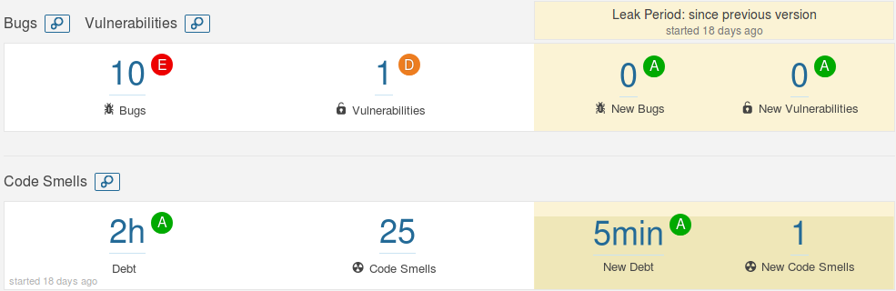
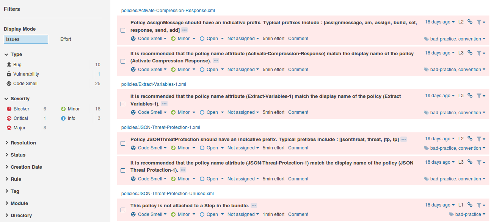
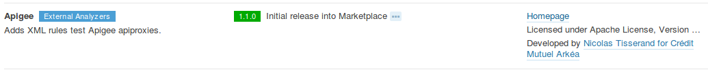

# Sonar Apigee Plugin

  

This SonarQube Plugin is designed to test Apigee apiproxies.
The goals is to help  API developers in doing a static analysis and providing issues to the Sonar engine.

The rules are based on the [apigeecs/bundle-linter](https://github.com/apigeecs/bundle-linter) and on this [document about best-practices](https://docs.apigee.com/api-services/content/best-practices-api-proxy-design-and-development). It deals also with some recommendations of these pages : [Introduction to antipatterns](https://docs.apigee.com/api-platform/antipatterns/intro)

All rules are not yet implemented ([see below](#implemented-rules)).
Apigee Shared Flows are not supported.

This plugin has been successfully tested with Sonarqube : 6.7.1, 6.7.6 LTS, 7.0, 7.3 and 7.7.

WARNING : 
* If you run older releases of Sonar, please consider upgrading, or stay with the release 1.3.1 of this plugin and with sonar-xml plugin 1.4.3.
* If you upgrade sonar-xml from 1.4.3 to 2.0.1-*, you **MUST** upgrade this sonar-apigee-plugin at the same time.

## Usage

### Some screenshots

<table>
 <tr>
  <td></td>
  <td></td>
</table>

### Requirements

To work, the plugin sonar-xml-plugin MUST be installed.

As Apigee also deals with Javascript and Python, it would be pertinent to install sonar-python-plugin and sonar-javascript-plugin, but it's not mandatory.

### Installation

 * Check that the sonarXML Plugin is already installed (minimum release 2.0.1.2020)
 * Use the Marketplace Update Center to install the Apigee plugin :
   
 * Restart the server

Then :
 * Set the "Sonar way Apigee" quality profile as default. You can also create a new profile and add it the rules coming from ApigeeXML and CommonXML repositories.
 * Add `.wsdl` and `.xslt` as suffixes to be analyzed in the XML Language administration.
 * Configure your Quality Gates as needed

### Build

If you want to try the very latest version :

    mvn clean install
  
You'll get a jar file in the target directory.

Copy this jar in the directory $SONARQUBE_HOME/extensions/plugins and restart the server.

## Why this plugin ?
 * because companies, like mine, prefer using a centralized platform like Sonar, instead of an standalone tool
 * because SonarQube provides a lot of tools, measures, issue management, ... out-of-the-box
 * because SonarQube is well integrated with CI platform like Jenkins. It's part of continuous delivery.

## Implemented Rules

The rule IDs come from the [apigeecs/bundle-linter](https://github.com/apigeecs/bundle-linter).
Other rules start from "500" to not interfer with the first rules. Example : PD500.

**Legend :**
>
>:heavy_check_mark: : implemented
>
>:heavy_multiplication_x: : not yet implemented
>
>:o: : won't be implemented. See details in Description column 

### Bundle level
| Status | Rule&nbsp;ID | Severity | Name | Description |
|:------:| ---- | -------- | ---- | ----------- |
|:heavy_multiplication_x:| BN001 | &nbsp; | Bundle folder structure correctness. | Bundles have a clear structure. |
|:heavy_multiplication_x:| BN002 | &nbsp; | Extraneous files. | Ensure each folder contains approrpriate resources in the bundle. |
|:heavy_check_mark:| BN003 | Major | Cache Coherence | A bundle that includes cache reads should include cache writes with the same keys. |
|:heavy_multiplication_x:| BN004 | &nbsp; | Unused variables. | Within a bundle variables created should be used in conditions, resource callouts, or policies. |
|:heavy_check_mark:| BN005 | Minor | Unattached policies. | Unattached policies are dead code and should be removed from production bundles. |
|:heavy_check_mark:| BN006 | &nbsp; | Bundle size - policies. | Large bundles are a symptom of poor design. A high number of policies is predictive of an oversized bundle. The threshold is defined in the Quality Profile. Default value is 20. |
|:heavy_check_mark:| BN007 | &nbsp; | Bundle size - resource callouts. | Large bundles are a symptom of poor design. A high number of resource callouts is indicative of underutilizing out of the box Apigee policies. The threshold is defined in the Quality Profile. Default value is 20. |
|:heavy_multiplication_x:| BN008 | &nbsp; | IgnoreUnresolvedVariables and FaultRules | Use of IgnoreUnresolvedVariables without the use of FaultRules may lead to unexpected errors. |
|:heavy_check_mark:| BN009 | &nbsp; | Statistics Collector - duplicate policies | Warn on duplicate policies when no conditions are present or conditions are duplicates. |
|:heavy_check_mark:| BN500 | Info | Description length | A Description tag should have more than N chars to be useful. "N" can be modified in the Quality Profile. The default value is 5. |
|:heavy_check_mark:| BN501 | Blocker | Description pattern | The Description of the APIProxy must be compliant with a pattern defined in the Quality Profile. For example : `.*\(code=([A-Z0-9]{4})\).*`. The default pattern is  `.*` |
|:heavy_check_mark:| BN502 | Minor | Unattached resources. | Unattached resources are dead code and should be removed from production bundles. This rule only checks XSL, XSD and  WSDL resources. Don't forget to add `.wsdl` as suffix to be analyzed in the XMLPlugin administration. |

### Proxy Definition level
| Status | Rule&nbsp;ID | Severity | Name | Description |
|:------:| ---- | -------- | ---- | ----------- |
|:heavy_check_mark:| PD001 | Blocker | RouteRules to Targets | RouteRules should map to defined Targets |
|:heavy_check_mark:| PD002 | Blocker | Unreachable Route Rules - defaults | Only one RouteRule should be present without a condition |
|:heavy_check_mark:| PD003 | Blocker | Unreachable Route Rules | RouteRule without a condition should be last. |
|:heavy_check_mark:| PD501 | Major | Too much proxy endpoints | Discourage the declaration of multiple proxy endpoints in a same proxy. The threshold is defined in the Quality Profile. Default value is 2. |

### Target Definition level
| Status | Rule&nbsp;ID | Severity | Name | Description |
|:------:| ---- | -------- | ---- | ----------- |
|:heavy_check_mark:| TD001 | Major | Mgmt Server as Target | Discourage calls to the Management Server from a Proxy via target. |
|:heavy_check_mark:| TD002 | Major | Use Target Servers | Encourage the use of target servers |
|:heavy_check_mark:| TD501 | Major | Too much Target Endpoints | Discourage the use of numerous target endpoints. The threshold is defined in the Quality Profile. Default value is 5. |

### Flow level
| Status | Rule&nbsp;ID | Severity | Name | Description |
|:------:| ---- | -------- | ---- | ----------- |
|:heavy_check_mark:| FL001 | Blocker | Unconditional Flows | Only one unconditional flow will get executed. Error if more than one was detected. |
|:heavy_check_mark:| FL500 | Critical | Default flow | A default flow must be defined to catch all requests on undefined resources. |
|:heavy_check_mark:| FL501 | Blocker | Unreachable flow | Flow without a condition must be last. |

### Step level
| Status | Rule&nbsp;ID | Severity | Name | Description |
|:------:| ---- | -------- | ---- | ----------- |
|:heavy_check_mark:| ST001 | Minor | Empty Step | Empty steps clutter the bundle. (Should never happen, Apigee already blocks this error form occuring.) |

### Policy level
| Status | Rule&nbsp;ID | Severity | Name | Description |
|:------:| ---- | -------- | ---- | ----------- |
|:heavy_check_mark:| PO001 | Major | JSON Threat Protection | A check for a body element should be performed before policy execution. |
|:heavy_check_mark:| PO002 | Major | XML Threat Protection | A check for a body element should be performed before policy execution. |
|:heavy_check_mark:| PO003 | Major | Extract Variables with JSONPayload | A check for a body element should be performed before policy execution. |
|:heavy_check_mark:| PO004 | Major | Extract Variables with XMLPayload | A check for a body element should be performed before policy execution. |
|:heavy_check_mark:| PO005 | Major | Extract Variables with FormParam | A check for a body element should be performed before policy execution. |
|:heavy_multiplication_x:| PO006 | &nbsp; | Policy Naming Conventions - default name | Policy names should not be default. |
|:heavy_check_mark:| PO007 | Minor | Policy Naming Conventions - type indication | It is recommended that the policy name include an indicator of the policy type. |
|:heavy_check_mark:| PO008 | Minor | Policy Name Attribute Conventions | It is recommended that the policy name attribute match the display name of the policy. |
|:heavy_check_mark:| PO009 | Major | Service Callout Target - Mgmt Server | Targeting management server may result in higher than expected latency use with caution. |
|:heavy_multiplication_x:| PO010 | &nbsp; | Service Callout Target - Target Server | Encourage use of target servers. |
|:heavy_multiplication_x:| PO011 | &nbsp; | Service Callout Target - Dynamic URLs | Error on dynamic URLs in target server URL tag. |
|:heavy_multiplication_x:| PO012 | &nbsp; | Service Callout Target - Script Target Node | JSHint, ESLint. |
|:o:| PO013 | &nbsp; | Resource Call Out - Javascript | Analyzed by sonar-javascript-plugin. |
|:o:| PO014 | &nbsp; | Resource Call Out - Java |  Analyzed by sonar-java-plugin. |
|:o:| PO015 | &nbsp; | Resource Call Out - Python |  Analyzed by sonar-python-plugin. |
|:heavy_multiplication_x:| PO016 | &nbsp; | Statistics Collector - duplicate variables | Warn on duplicate variables. |
|:heavy_multiplication_x:| PO017 | &nbsp; | Misconfigured - FaultRules/Fault Rule in Policy | FaultRules are configured in ProxyEndpoints and TargetEndpoints. |
|:heavy_check_mark:| PO018 | Major | Regex Lookahead/Lookbehind are Expensive - Threat Protection Policy | Regular expressions that include lookahead or lookbehind perform slowly on large payloads and are typically not required.|
|:heavy_check_mark:| PO019 | Major | Reserved words as variables - ServiceCallout Request | Using "request" as the name of a Request may cause unexpected side effects.|
|:heavy_check_mark:| PO020 | Major | Reserved words as variables - ServiceCallout Response | Using "response" as the name of a Response may cause unexpected side effects.|
|:heavy_multiplication_x:| PO021 | &nbsp; | Statistics Collector - reserved variables | Warn on insertion of duplicate variables. |
|:heavy_check_mark:| PO022 | &nbsp; | Nondistributed Quota | When using nondistributed quota the number of allowed calls is influenced by the number of Message Processors (MPs) deployed. This may lead to higher than expected transactions for a given quota as MPs now autoscale. |
|:heavy_multiplication_x:| PO023 | &nbsp; | Quota Policy Reuse | When the same Quota policy is used more than once you must ensure that the conditions of execution are mutually exclusive or that you intend for a call to count more than once per message processed. |
|:heavy_check_mark:| PO024 | &nbsp; | Cache Error Responses | By default the ResponseCache policy will cache non 200 responses. Either create a condition or use policy configuration options to exclude non 200 responses. |
|:heavy_check_mark:| PO500 | Major | Avoid Python language | Python scripts can introduce performance bottlenecks for simple executions, as it is interpreted at runtime. |

### FaultRules level
| Status | Rule&nbsp;ID | Severity | Name | Description |
|:------:| ---- | -------- | ---- | ----------- |
|:heavy_check_mark:| FR001 | Major | No Condition on FaultRule | It's not a best practice to have a FaultRule without an outer condition, which automatically makes the FaultRule true. |
|:heavy_check_mark:| FR501 | Major | FaultRules or DefaultFaultRule must be used | It's needed to prevent default error messages from the backend or from Apigee to be forwarded outside. |
|:heavy_check_mark:| FR502 | Critical | DefaultFaultRule defined and FaultRule without condition | A DefaultFaultRule is defined whereas a FaultRule without condition exists. Consider removing the FaultRule without condition. |

### Conditional level
| Status | Rule&nbsp;ID | Severity | Name | Description |
|:------:| ---- | -------- | ---- | ----------- |
|:heavy_multiplication_x:| CC001 | &nbsp; | Literals in Conditionals | Warn on literals in any conditional statement. |
|:heavy_multiplication_x:| CC002 | &nbsp; | Null Blank Checks | Blank checks should also check for null conditions. (to be reviewed) |
|:heavy_check_mark:| CC003 | Minor | Long condition statement | Conditions should not be longer than "N" characters. "N" can be modified in the Quality Profile. The default value is 255. |
|:heavy_multiplication_x:| CC004 | &nbsp; | Overly complex condition | Condition complexity should be limited to fix number of variables and conjunctions. |
|:heavy_multiplication_x:| CC006 | &nbsp; | Detect logical absurdities | Conditions should not have internal logic conflicts - warn when these are detected. |

